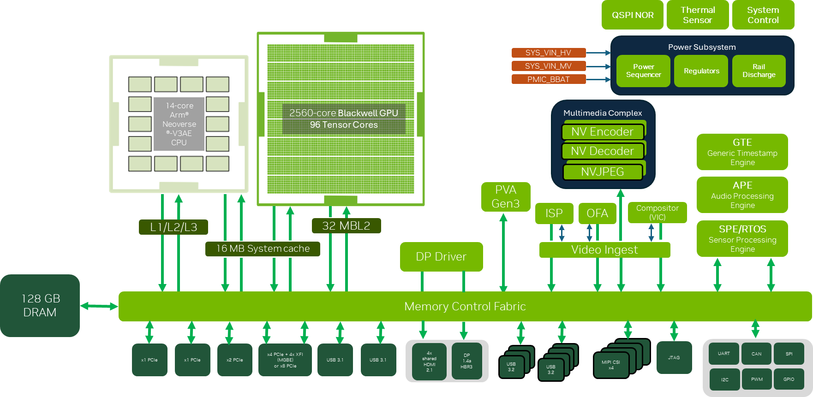

# Hardware

## NVIDIA Jetson Thor

[NVIDIA Jetson Thor](https://developer.nvidia.com/blog/introducing-nvidia-jetson-thor-the-ultimate-platform-for-physical-ai/)

| Spec | Jetson AGX Thor Developer Kit |
| --- | --- |
| GPU Max Frequency | 1.57 GHz |
| Tensor Core Peak Performance (FLOPS) | 1035 TFLOPS (FP4-Dense) |
| Multiprocessors | 20 |
| CUDA Cores / MP | 128 |
| Maximum number of threads / MP| 1536 |
| Global Memory | 128 GB 256-bit LPDDR5X |
| Peak Memory Bandwidth | 273 GB/s |
| Shared Memory | 228 KiB |
| L2 Cache | 32 MB |

Tensor Core Peak Performance: 8192 FP4 Dense Flops/cycle/tc

For BF16, 2048 flops/cycle/tc -> 8192 flops/cycle/sm -> 8192 * 1.575 GHz = 12.9 TFLOPS/sm
